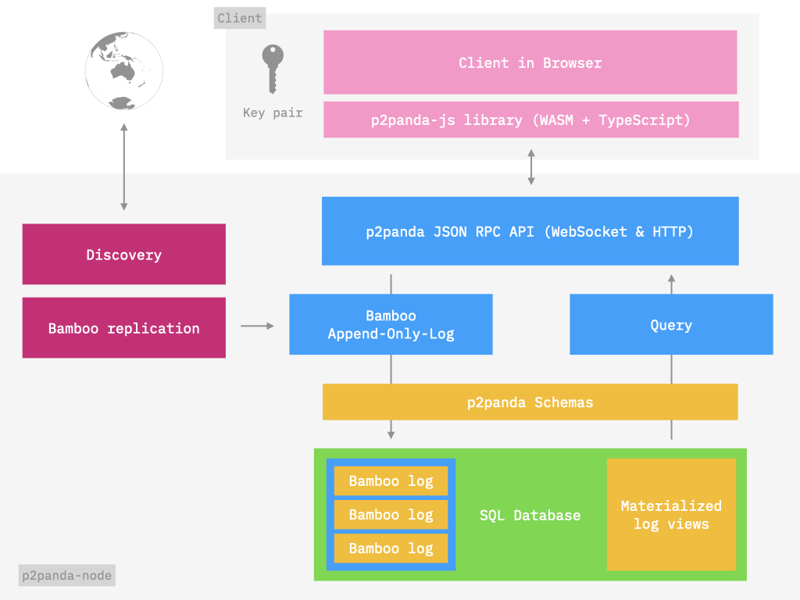
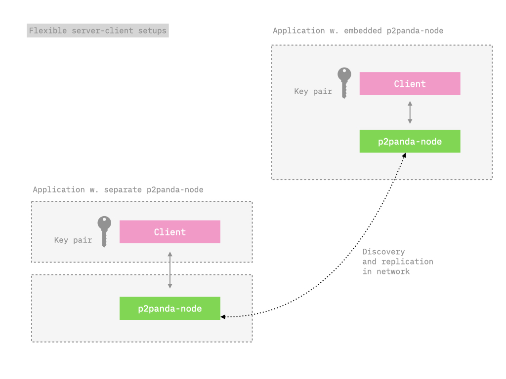

# Architecture

The p2panda network consists of **clients**, which create new data, and **servers** which receive it. Servers check first if all incoming data is valid before they store it. After storing the data, servers discover other peers to sync the latest data with them.

One can roughly describe clients as **data creators** and servers as **data distributors**. Clients generate a key pair when you start them for the first time. Key pairs are the most sensitive bit of information and only known to the client, usually stored locally for one user. It is used to sign newly created data, similar to a signature under a letter making sure your identity is proven when sending it somewhere else.

Newly created data by clients is sent directly to a server via a RPC API which is an interface to communicate with each other. Servers check the incoming data and make sure its well-formed, cryptographically verified (eg. "is your signature correct?") and valid before storing it. Together all servers in the network form a distributed, *eventually consistent* database of the data, fed by all clients around them. Servers can not create any data themselves, they just make sure the data is stored somewhere for further transmission while keeping its structure and integrity consistent.

Servers also *materialise* the data they store, which means they make it faster and easier to query it. Clients can not only create data but also request the server via the RPC API to send them what it knows about a certain topic, author or kind, like *"Send me all the posts from this user?"* or *"What are the pictures attached to this event?"* to finally display the responses to the user in an interface.

## Overview

**Server**

* Holds all known data (append-only logs). Awaits signed messages from clients via an API which then are added to the logs and internally stored in the database.
* Accepts queries to filter currently known data and returns it to the client via an API.
* Verifies the consistency and signature of logs and rejects invalid ones.
* Finds other servers (discovery).
* Distributes / syncs data with other servers (replication).

**Client**

* Renders data in an user interface which got requested from Server via API.
* Holds and manages the generated key pair and sensitive informations (private key).
* Signs new messages with private key and sends them via API to Server.

## Federated vs. decentralised setups

Depending on your preferences and chosen trade-offs, a client and server can run on different computers or on the same one, sometimes even within the same application if necessary.

This following table roughly compares the advantages of the different network topologies:

| Feature | Federated | Decentralised |
| --- | --- | --- |
| Works offline | :interrobang: | :heavy_check_mark: |
| Trust own node | :interrobang: | :heavy_check_mark: |
| Browser friendly | :heavy_check_mark: | :interrobang: |
| Static IP | :heavy_check_mark: | :interrobang: |
| Can be used by many | :heavy_check_mark: | :interrobang: |

With these two components a few setup configurations for p2panda are imaginable:

* Website (hosted via HTTP server) communicating with external node (hosted on dedicated p2panda hardware or any other machine).
* Electron / Tauri (or similar) Desktop application which contains both server and client.
* Website which contains both server and client (not possible right now due to browser limitations / performance bottlenecks).
